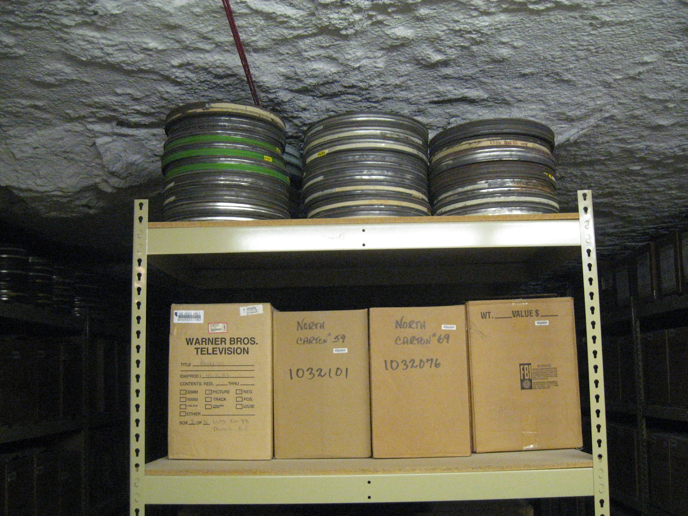

# Research Data Management and Open Research

A presentation for the [**Pennine Water Group**](https://www.sheffield.ac.uk/penninewatergroup) (PWG), University of Sheffield

by [**Will Furnass**](https://www.shef.ac.uk/civil/staff/research/furnassw), PhD student

Thursday 3rd April 2014 

## Overview ##

1. What data do we use/produce?
1. Why share it?
1. Citing data
1. Producing data: 
   1. Storage and file formats
   1. Metadata and context
1. Data Management Plans
1. Issues?
1. Where next?  Literate programming?

## PWG data ##

 * PIV/ADV/camera data
 * Hydraulic models (proprietary formats?)
 * SCADA and field monitoring (P, Q, quality)
 * Microscopy
 * Molecular biology (v. large)
 * Green roof data
 * Societal (usage, attitudes)
 * Geographical (DEM, asset topologies/attributes; land use)
 * Artificial data (turbulence model testing)
 * Machine learning inputs (collated; some real-time)
 * CFD models
 * Calibrated empirical models (parameters as data)
 * Algorithms; pre/post-processing code; software libraries
 * Simulations/predictions

Why/how would/could we share this?  

Size, metadata, IP, confidentiality...

##EPSRC expectations re RDM ##

Research data: 

>is recorded factual material commonly retained by and accepted in the scientific community as necessary to validate research findings.

 * Public good produced in the public interest
 * Should be made freely and openly available with as few restrictions as possible in a timely and responsible manner
 * Researchers should acknowledge data sources
 * Limited period of privileged access to the data they collect to allow them to work on and publish their results
 * RDM should reflect relevant standards and community best practice and should exist for all data.  Importance of sound archiving.
 * Metadata needed for understanding potential for future research and for re-use.  Need to make available with published results.
 
Alignment from May 2012; full compliance from May 2015

## Why engage with open research data initiative ##

 * Increased visibility, citations
 * Reproducible research (for review and after publication)
 * Resolve disputes
 * More eyes to help find erroneous data/conclusions
 * Meta-analysis
 * Egalitarian open research: provide public with data it funded
 * Others?

## Changing attitudes of journals ##

Nature:

>a condition of publication in a Nature journal is that authors are required to make materials, data and associated protocols promptly available to readers without undue qualifications

>Supporting data must be made available to editors and peer-reviewers at the time of submission for the purposes of evaluating the manuscript.

PLOS ONE:

>Publication is conditional upon the agreement of the authors to make freely available any materials and information described in their publication that may be reasonably requested by others.

>PLOS ONE will not consider a study if the conclusions depend solely on the analysis of proprietary data

## Citing data ##

Why?  

According to DataCite:

 * enables easy reuse and verification of data
 * allows the impact of data to be tracked
 * creates a scholarly structure that recognises and rewards data producers
 * Assign DOI
 * Cite with revision and resource type?
 * e.g.

Irino, T and Tada, R (2009). *Chemical and mineral compositions of sediments from ODP Site 127-797.*  Geological Institute, University of Tokyo. doi:[10.1594/PANGAEA.726855](http://dx.doi.org/10.1594/PANGAEA.726855)

## Storage and file formats ##

(http://thecancellationstation.blogspot.co.uk/2012/05/side-dish-kansas-underground-salt.html)

Issues

 * File format readable in 5 years? 10 years?  
 * Proprietory format?  Loss of fidelity if convert to open format?  
 * Bitrot
 * Hardware failure
 * Accessibility
 * Security
 * Cost

Strategies

 * Lossless, open, simple formats e.g. zip-compressed csv, shapefile)
 * Duplication *and* backups
 * Checksums (e.g. `md5sum my_data.h5 -> c55318a4bbfe3134fefc8747ae43b69d`)
 * Version control (e.g. Git - gives checksums) 
 
 * Online or by request?
 * UK Data Archive, local fileserver (CICS VPS, cPanel, FTP, PWG file server)

## Separation of data and processing ##

* Publish processed data and prose description of processing method
* or publish raw data and processing code/algorithm?

* How costly was (pre)processing (time/money)?
* Can (pre)processing software be made readily available?

## Metadata ##

 * e.g. timestamps, IDs, geotags
 * Data often meaningless without it
 * Often not well documented
 * Metadata standards exist

## Context ##

 * Different to metadata
 * Important but exposes limitations/subjectivity of research?

## Key questions##

 * How/when to capture both?  Too late when researcher left.
 * Could your results be reproduced using thesis/papers, data and additional documentation? 

## Planning for PIs ##

All EPSRC funded projects must now have Data Management Plans (DMPs)

Plan for 

 * storage and formats
 * metadata and context capture
 * anonymisation of data
 * embargo periods
 * version control
 * access, sharing, and re-use
 * budget

 ## Responsibility for costs ##

 * Costs relating to systems and infrastructure relating to storage and management of RD can be covered by public funds.  
 * Institutions are expected to cover costs from within received funding, using both direct and indirect streams where appropriate
 * Institutions may wish collaborate on commissioning RDM services from a third party provider

## Issues? ##

 * Getting gazumpt
 * Being misrepresented
 * Time
 * Knowing what contextual info and metadata are pertinent
 * Cost in time and money of documentation/storage/archiving
 * Others?
 
Feedback to be given to UoS RDM tzar

## Where next? Literate programming? ##

Donald Knuth. "Literate Programming (1984)" in Literate Programming. CSLI, 1992, pg. 99.

>I believe that the time is ripe for significantly better documentation of programs, and that we can best achieve this by considering programs to be works of literature. Hence, my title: "Literate Programming."

>Let us change our traditional attitude to the construction of programs: Instead of imagining that our main task is to instruct a computer what to do, let us concentrate rather on explaining to human beings what we want a computer to do.

### IPython Notebook ###

Blocks containing 

 * Code 
 * Formatted text
 * Mathematical formulae
 * Program output (text and figures
 * Links 

e.g. [Titanic Machine Learning from Disaster](http://nbviewer.ipython.org/github/agconti/kaggle-titanic/blob/master/Titanic.ipynb)

Living journal papers linking open source software and open research data for reproducible research?

## More information ##

 * [datalib.edina.ac.uk/mantra](http://datalib.edina.ac.uk/mantra): online course designed for researchers or others planning to manage digital data as part of the research process.
 * EPSRC expectations
 * Digital Curation Centre ([dcc.ac.uk](http://www.dcc.ac.uk))
 * [dmponline.dcc.ac.uk](http://dmponline.dcc.ac.uk): tool for writing data management plans

Contacts:
 
 * [Jez Cope](https://www.sheffield.ac.uk/library/liaison/research), Research Data Manager
 * [John Lewis](https://www.sheffield.ac.uk/library/liaison/research), Research Data Management Liaison Assistant (rdm@sheffield.ac.uk)
 * CiCS

## Summary ##

 * Many drivers for sharing research data (both carrots and sticks) 
 * Storage, confidentiality, metadata and documentation requirements are complex
 * Need to take more proactive approach using DMP to best meet RC needs
 * Moving towards use of OSS and open data for reproducibility?

### Thank you for listening ###

*Any questions?*
